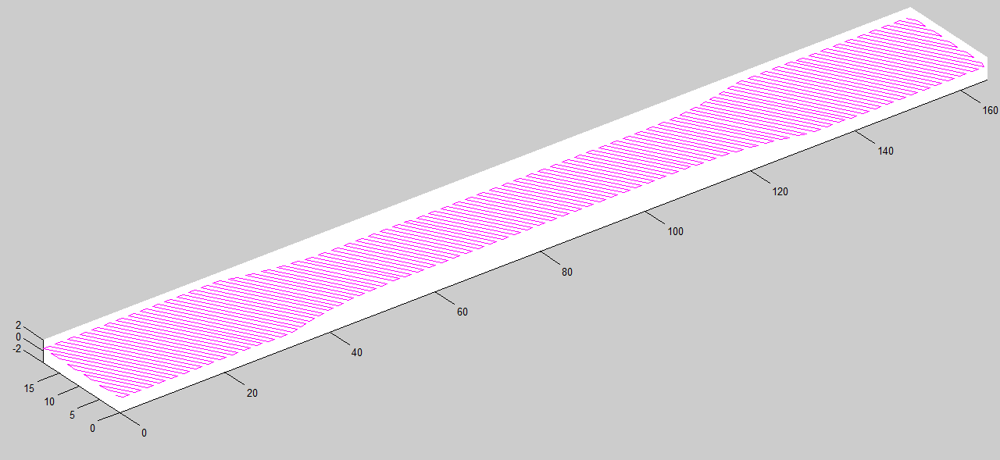

# Machine Learning Engineer @ Dematic, Kion Mobile Automation
- Developing intelligent, automated solutions for manufacturing, warehouse, and distribution environments sold by [KION Group](https://www.kiongroup.com/en/About-us/KION-at-a-glance/) and its operating units [Dematic](https://www.dematic.com/en-us/products/products-overview/agv-systems/), [STILL](https://www.still.de/en-DE/intralogistics-systems/automation-systems.html) and [Linde](https://www.linde-mh.com/en/Product-Finder/index.html?productTypes[]=2368). 
- Directly involved with developing on-vehicle Simultaneous Localization and Mapping (SLAM) software for [AGVs](https://www.kiongroup.com/en/News-Stories/Stories/Automation/Story-Detail_19968.html) and [AMRs](https://www.kiongroup.com/en/News-Stories/Stories/Growing-in-China/Story-Detail_34432.html). Also contributing to develop automated driving for [collaborative AGVs](https://www.kiongroup.com/en/News-Stories/Press-Releases/Press-Releases-Detail.html?id=33024&type=internal&title=Excellent%20picking%20performance:%20STILL%20OPX%20iGo%20neo%20triumphs%20at%20Telematics%20Award) which perform order picking.
- Developing a robust SLAM algorithm testing pipeline using ROS, Gazebo and Rviz.
- Creating Occupancy Grids for 2D and 3D Lidar sensors using Gmapping, Octomap and Cartographer.
- Evaluating the use of Visual Inertial Odometry and GraphSLAM to improve AGV navigation in warehouse environments.
- To see AGVs in action at customer's site, check out the videos [here](https://www.youtube.com/watch?v=qnB6AhUDGwE), [here](https://www.youtube.com/watch?v=kYLGAisXTNk&feature=emb_title), [here](https://www.youtube.com/watch?v=MRJD1L6-Q1M) and [here](https://www.youtube.com/watch?v=KZww5lcbfNk&t=85s).

    <video autoplay loop playsinline muted style="width:49%;">
        <!--https://www.youtube.com/watch?v=_zAH9TiMPgU-->
        <source src="../assets/experience/AGVs.mp4" type="video/mp4">
        Your browser does not support the video tag.
    </video>
    <video autoplay loop playsinline muted style="width:49%;">
        <source src="../assets/experience/AMRs.mp4" type="video/mp4">
        Your browser does not support the video tag.
    </video>

# Autonomous Vehicle Projects @ Udacity Nanodegree Program 
- ## Lane Detection [(link1)](https://github.com/ssharma1991/autonomous-car-basic-lane-detection), [(link2)](https://github.com/ssharma1991/autonomous-car-advanced-lane-detection)
    - Created a robust image processing pipeline to detect a highway lane in an image, pre-recorded video, or live-feed from dashcam.
    - Calculated the car's position within lane and lane curvature using perspective transform and polynomial fitting.

- ## Traffic Sign Classification [(link)](https://github.com/ssharma1991/autonomous-car-traffic-sign-classification)
    - Developed a LeNet inspired convolution neural network using TensorFlow to classify the GTSRB traffic sign dataset.
    - Achieved 94.8% accuracy on test dataset by data augmentation and image enhancement using OpenCV.

- ## Traffic Light Awareness
    - Used SSD Mobilenet for real-time traffic light detection and classification.

- ## Behavioral Cloning [(link)](https://github.com/ssharma1991/autonomous-car-behavioral-cloning)
    - Designed an end-to-end convolution neural network using Keras that predicts steering angles from dash-cam images.
    - Successfully cloned human driving behavior to autonomously steer a car around a virtual test track after neural network tuning and data
    augmentation.

- ## Sensor Fusion [(link)](https://github.com/ssharma1991/autonomous-car-sensor-fusion)
    - Implemented car location estimation algorithm using extended Kalman Filter based on LIDAR and RADAR sensors data.

- ## Localization [(link)](https://github.com/ssharma1991/autonomous-car-localization)
    - A 2D particle filter for sparse localization is designed and uses GPS and sensor data with a landmark map.

- ## Trajectory Planning [(link)](https://github.com/ssharma1991/autonomous-car-highway-driving)
    - A Finite State Machine based planner is created to achieve autonomous highway driving with other cars.
    - Jerk minimized trajectories are considered to enhance occupant safety.

- ## Control [(link)](https://github.com/ssharma1991/autonomous-car-PID-control)
    - A PID controller is implemented to maneuver a vehicle around a virtual track using steering, throttle and brake. 

- ## System Integration
    - Robot Operation System (ROS) is used to robustly combine Perception, Planning, and Control.

    
    

    
    
    

 

# Research Assistant @ CAD Innovation and Engineering Lab
- ## Robotics
    - Developed [SnappyXO](http://snappyxo.com/), a laser-cut design-driven robotics platform that enables designing mechanisms, structures, and robots. 
    - It has successfully raised $16K+ on [Indiegogo](https://www.indiegogo.com/projects/snappyxo-a-design-driven-robotics-education-kit) for a crowdfunding campaign.
    - Organized workshop "Designing, Prototyping and Programming Robot Motions using MotionGen and SnappyXO" at [IDETC 2018](https://archive.asme.org/events/idetccie2018/program/workshops-tutorials) and "Kinematic Summer School" at [IDETC 2019](https://sites.google.com/stonybrook.edu/2019kiss).
    - Mentored multiple teams, as part of the Vertically Integrated Projects [(VIP)](https://www.stonybrook.edu/commcms/vertically-integrated-projects/teams/_team_page/team_page.php?team=Robotics-driven%20Engineering%20Design%20Exploration) program, for Robotics-driven Engineering Design Exploration. Some of the projects were Walking Robots, Self-driving Car, Sumo/Battle Bot, Biomimetic Robots, Drones and Bots with Arduino alternative microcontrollers.

    

    
    
    

     

- ## Mechanism Design Software [(link)](https://github.com/ssharma1991/MotionGen-Server)
    - Developing a Computational Framework for Data-Driven Mechanism Design Innovation supported by $450K [NSF grant](https://nsf.gov/awardsearch/showAward?AWD_ID=1563413).
    - Created [MotionGen](https://www.stonybrook.edu/commcms/motiongen/) a web-based mechanism design framework. Try it out [here](http://cadcam.eng.sunysb.edu/).
    - It uses MEAN (MongoDB, Express.js, Angular.js, Node.js) stack to create a RESTful web service based on MVC architecture. 
    - Both [iOS](https://apps.apple.com/us/app/motiongen/id1065657088) and [Android](https://play.google.com/store/apps/details?id=com.stonybrookuniversity.motiongen&hl=en&gl=US) apps have been created using Apache Cordova framework.

    

    
    
    
    

    

- ## Research and Algorithms
    - Path synthesis of mechanisms based on Fourier descriptor fitting using Nelder-Mead and Simulated Annealing optimization.
    - Mixed motion and path mechanism synthesis using optimal non-uniform DFT and Singular Value Decomposition.
    - Real-time simulation of planar, spherical and spatial mechanisms with prismatic and revolute joints using Newton-Raphson optimization.
    - Developed unified planar, spherical and spatial mechanisms synthesis techniques using Homotopy methods for simultaneous type and dimensional synthesis.
    - Developing machine learning based techniques for path synthesis using spatial platform linkages.
    
    

    
    
    

    

    
    
    
    

    

    
    
    
    

# Product Design @ Vivonics, Inc.
- Coordinated with design team on developing PMT Monitor, a portable medical headset which detects head trauma.
- Generated concepts for a mechanism which adjusts the interpupillary distance between the lenses focusing on manufacturability and robustness.

    
    

 

# Design and Manufacturing @ Leviathan Energy
- Designed and manufactured Hydro-kinetic turbine with improved airfoil design which produce 50% more power in collaboration with Leviathan Energy.
- Created engineering models using Solidworks and Autodesk Inventor and fabricated parts by FDM based 3D printing.

    
    

 

# Research Fellow @ IIIT Jabalpur
- Led a $70k+ research project funded by the Science and Engineering Research Board titled “Development of Additive-Subtractive Integrated Rapid Prototyping System for Improved Part Quality”.
- Spearheaded design and manufacturing teams to create a new hybrid 3D printing process using Pellet based Screw Extruder with CNC machines. Created Toolpath Planning strategies to manufacture CAD models using Hybrid Manufacturing techniques.

    
    

    

 