## Research Assistant @ CAD Innovation and Engineering Lab
- ### Mechanism Design Software [(link)](https://github.com/ssharma1991/MotionGen-Server)

    - Developing a Computational Framework for Data-Driven Mechanism Design Innovation supported by $450K [NSF grant](https://nsf.gov/awardsearch/showAward?AWD_ID=1563413).
    - Created [MotionGen](http://cadcam.eng.sunysb.edu/) a web-based mechanism design framework. 
    - It uses MEAN (MongoDB, Express.js, Angular.js, Node.js) stack to create a RESTful web service based on MVC architecture. 
    - Both iOS and Android apps have been created using Apache Cordova framework.

    

    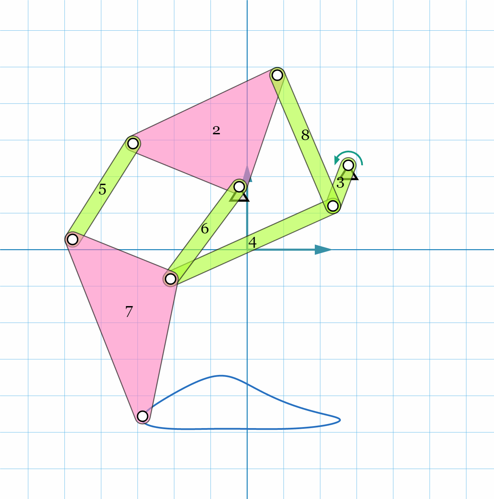
    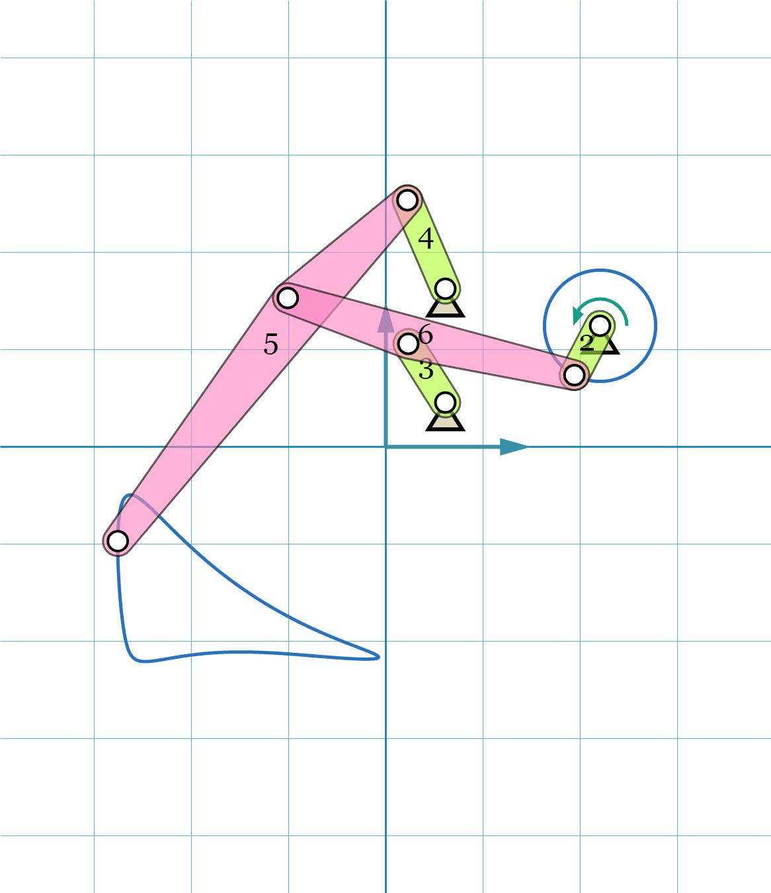
    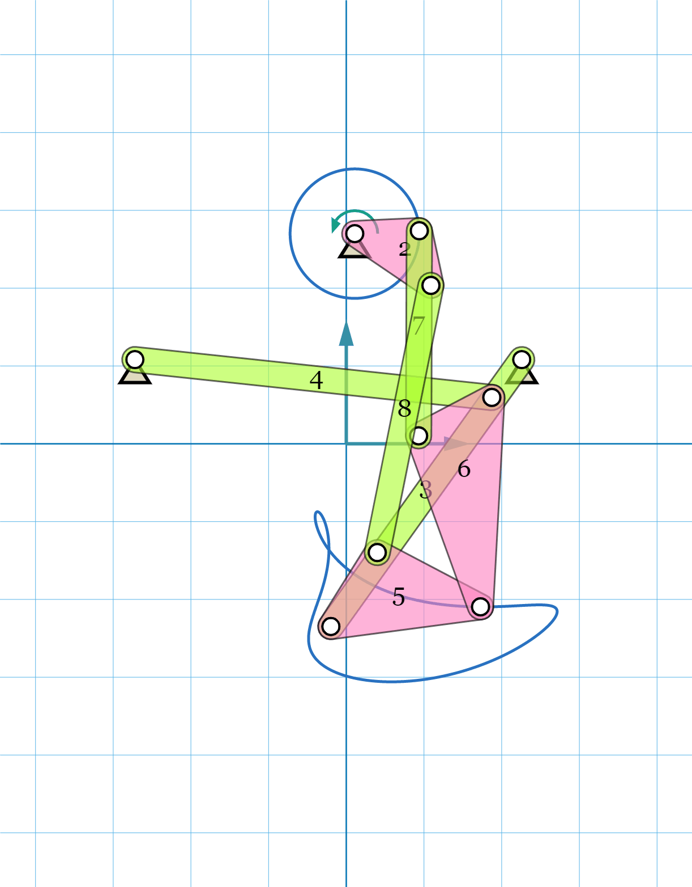
    

    

- ### Research and Algorithms
    - Path synthesis of mechanisms based on Fourier descriptor fitting using Nelder-Mead and Simulated Annealing optimization.
    - Mixed motion and path mechanism synthesis using optimal non-uniform DFT and Singular Value Decomposition.
    - Real-time simulation of planar, spherical and spatial mechanisms with prismatic and revolute joints using Newton-Raphson optimization.
    - Developed unified planar, spherical and spatial mechanisms synthesis techniques using Homotopy methods for simultaneous type and dimensional synthesis.
    - Developing machine learning based techniques for path synthesis using spatial platform linkages.
    
    

    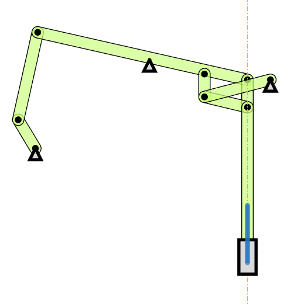
    
    

    

    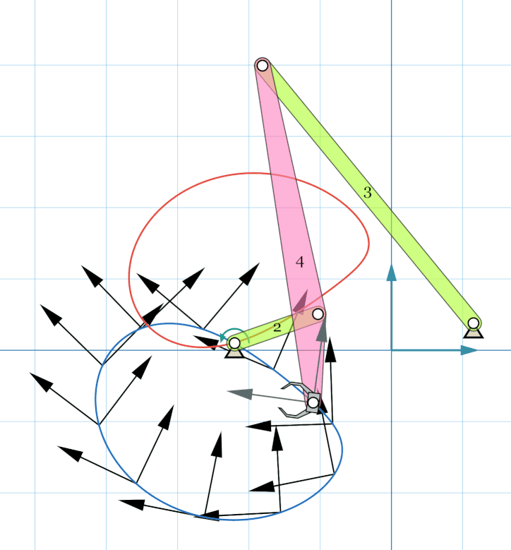
    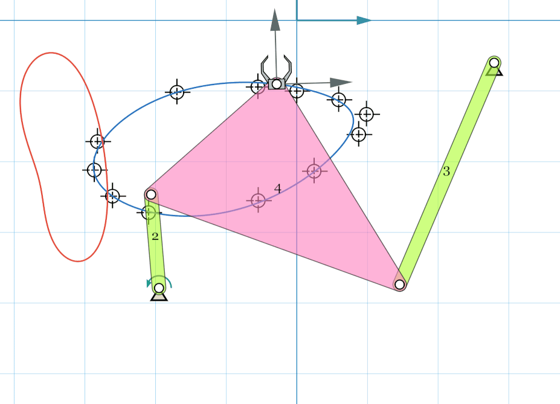
    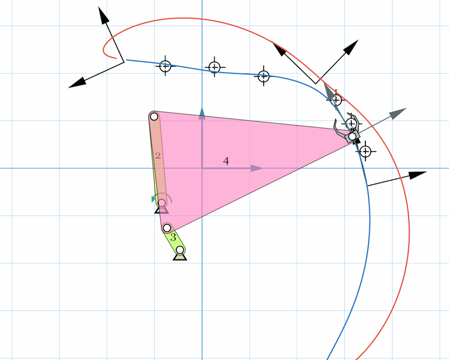
    

    

    
    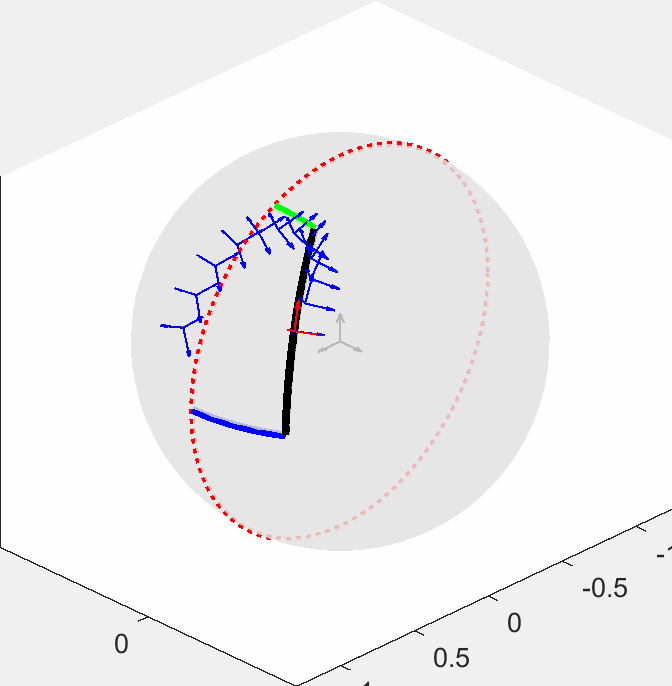
    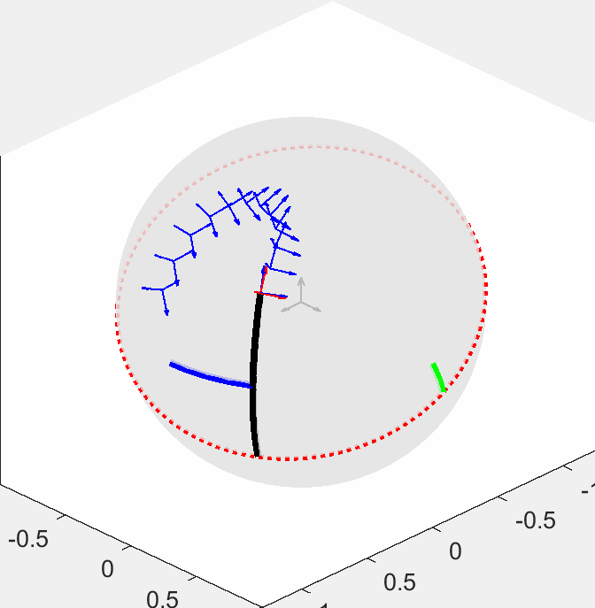
    

- ### Robotics
    - Developed [SnappyXO](http://snappyxo.com/), a laser-cut design-driven robotics platform that enables designing mechanisms, structures, and robots. 
    - It has successfully raised $16K+ on [Indiegogo](https://www.indiegogo.com/projects/snappyxo-a-design-driven-robotics-education-kit) for a crowdfunding campaign.
    - Organized workshop "Designing, Prototyping and Programming Robot Motions using MotionGen and SnappyXO" at [IDETC 2018](https://archive.asme.org/events/idetccie2018/program/workshops-tutorials) and "Kinematic Summer School" at [IDETC 2019](https://sites.google.com/stonybrook.edu/2019kiss).

    

    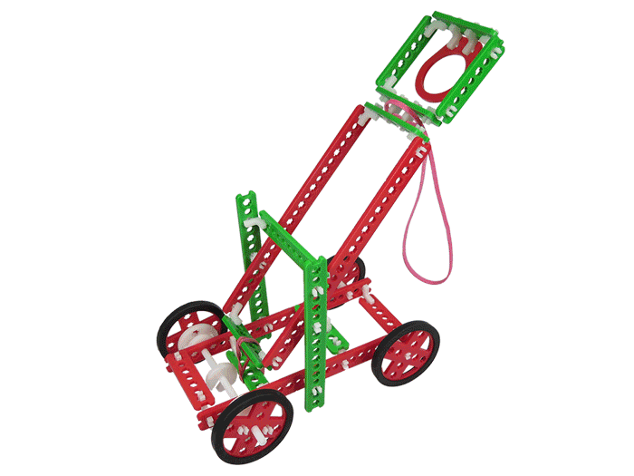
    
    

## Autonomous Vehicle Projects @ Udacity Nanodegree Program 
- ### Lane Detection [(link1)](https://github.com/ssharma1991/autonomous-car-basic-lane-detection), [(link2)](https://github.com/ssharma1991/autonomous-car-advanced-lane-detection)
    - Created a robust image processing pipeline to detect a highway lane in an image, pre-recorded video, or live-feed from dashcam.
    - Calculated the car's position within lane and lane curvature using perspective transform and polynomial fitting.

- ### Traffic Sign Classification [(link)](https://github.com/ssharma1991/autonomous-car-traffic-sign-classification)
    - Developed a LeNet inspired convolution neural network using TensorFlow to classify the GTSRB traffic sign dataset.
    - Achieved 94.8% accuracy on test dataset by data augmentation and image enhancement using OpenCV.

- ### Traffic Light Awareness
    - Used SSD Mobilenet for real-time traffic light detection and classification.

- ### Behavioral Cloning [(link)](https://github.com/ssharma1991/autonomous-car-behavioral-cloning)
    - Designed an end-to-end convolution neural network using Keras that predicts steering angles from dash-cam images.
    - Successfully cloned human driving behavior to autonomously steer a car around a virtual test track after neural network tuning and data
    augmentation.

- ### Sensor Fusion [(link)](https://github.com/ssharma1991/autonomous-car-sensor-fusion)
    - Implemented car location estimation algorithm using extended Kalman Filter based on LIDAR and RADAR sensors data.

- ### Localization [(link)](https://github.com/ssharma1991/autonomous-car-localization)
    - A 2D particle filter for sparse localization is designed and uses GPS and sensor data with a landmark map.

- ### Trajectory Planning [(link)](https://github.com/ssharma1991/autonomous-car-highway-driving)
    - A Finite State Machine based planner is created to achieve autonomous highway driving with other cars.
    - Jerk minimized trajectories are considered to enhance occupant safety.

- ### Control [(link)](https://github.com/ssharma1991/autonomous-car-PID-control)
    - A PID controller is implemented to maneuver a vehicle around a virtual track using steering, throttle and brake. 

- ### System Integration
    - Robot Operation System (ROS) is used to robustly combine Perception, Planning, and Control.

    
    

    
    
    

## Product Design @ Vivonics, Inc.
- Coordinated with design team on developing PMT Monitor, a portable medical headset which detects head trauma.
- Generated concepts for a mechanism which adjusts the interpupillary distance between the lenses focusing on manufacturability and robustness.

    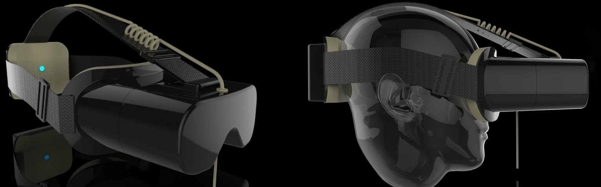
    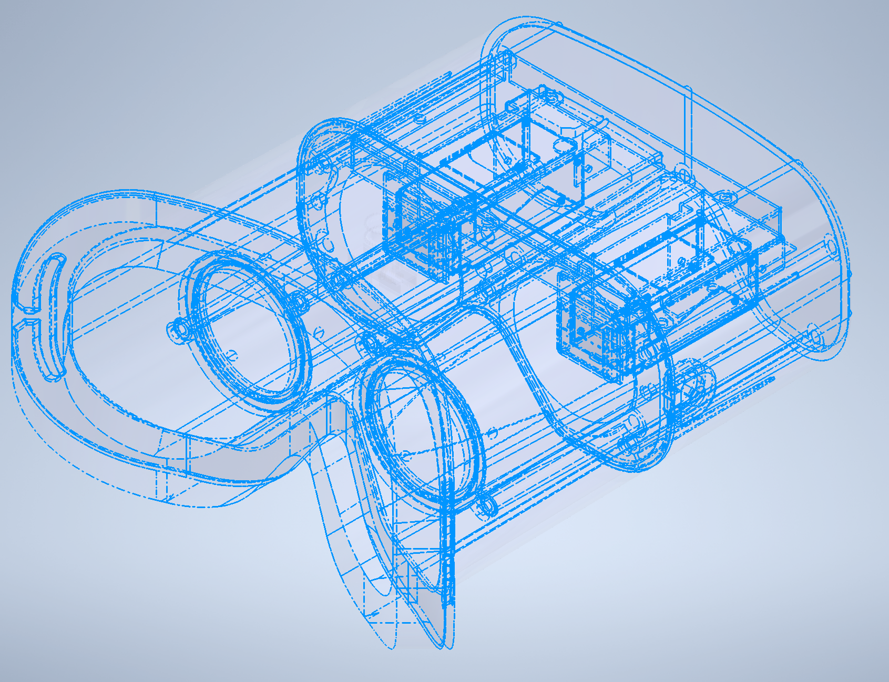

## Design and Manufacturing @ Leviathan Energy
- Designed and manufactured Hydro-kinetic turbine with improved airfoil design which produce 50% more power in collaboration with Leviathan Energy.
- Created engineering models using Solidworks and Autodesk Inventor and fabricated parts by FDM based 3D printing.

    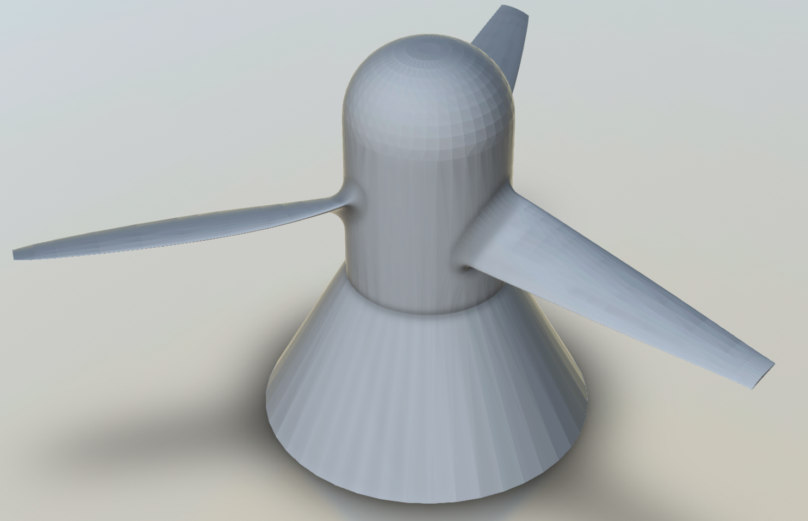
    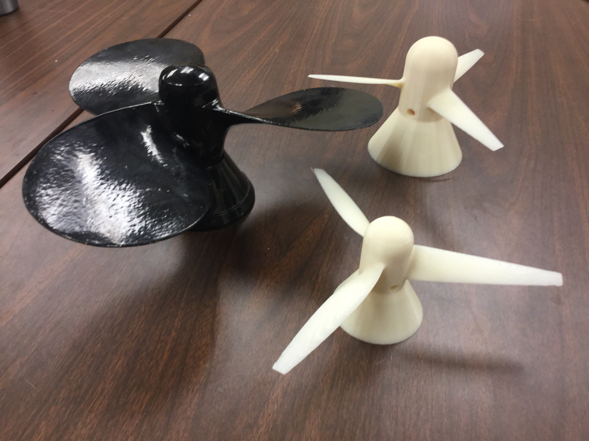

## Research Fellow @ Indian Institute of Information Technology, Jabalpur
- Led a $70k+ research project funded by the Science and Engineering Research Board titled “Development of Additive-Subtractive Integrated Rapid Prototyping System for Improved Part Quality”.
- Spearheaded design and manufacturing teams to create a new hybrid 3D printing process using Pellet based Screw Extruder with CNC machines. Created Toolpath Planning strategies to manufacture CAD models using Hybrid Manufacturing techniques.

## Course Projects @ Stony Brook University
- ### A Machine Learning approach to Path Synthesis of crank-rocker mechanisms
    - Path tracing mechanisms with optimum transmission angle are synthesized using Artificial Neural Network.
    - Input features are calculated using Wavelet transformation to capture the temporal path information.

- ### Motion Planning for a Robot with Two Anthropomorphic 6-DOF Arms
    - Inverse Kinematics and Dual Quaternion interpolation based optimal trajectory planning to pick and place objects considering individual arm’s workspace and dexterity.

- ### Interactive Manipulation of NURBS Surfaces
    - OpenGL based implementation in C++ for interactive manipulation of Non Uniform Rational B-Spline Surfaces.

- ### Fracture test analysis for compact tension specimen
    - Finite element analysis of a fracture specimen to predict and validate deformations at the crack tip.

- ### Conceptual Design
    - Conceptual design of an Ergonomic Nutcracker and Stone Crusher.
    - Formulation of product design specification and criteria and generation of the best possible product concept.

- ### Quality Improvement of Aircraft Wing Assembly
    - Identifying and correcting the root cause for high rejection rate of final assembly using Pareto Charts, Cause and Effect Diagrams, Control Charts and Histograms.